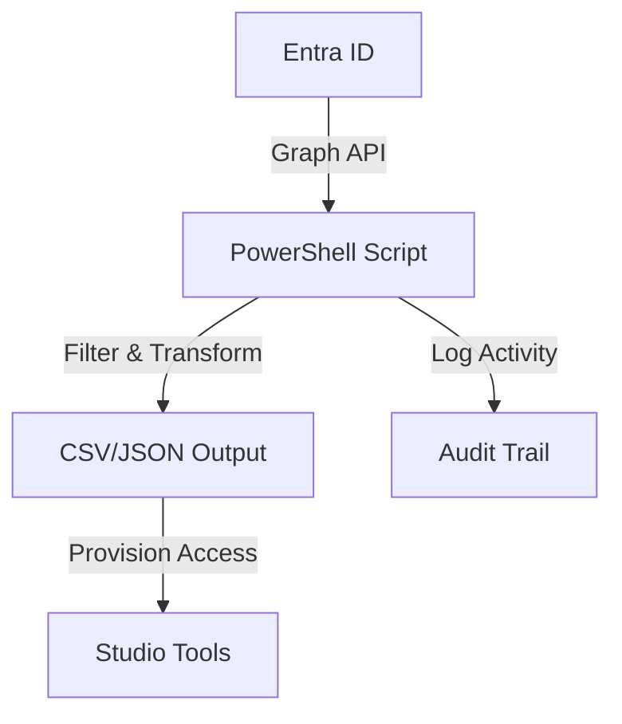

# Entra ID User Sync for M&E Workflows

## Overview
This repository provides a hardened PowerShell script that synchronizes Microsoft Entra ID (Azure AD) users into a local output such as CSV or JSON. Media and entertainment studios can use the export to power file share permissions, render farm access, or digital asset management integrations while maintaining centralized identity governance.

Highlights:
- OAuth 2.0 client credential authentication against Microsoft Graph.
- Optional group filtering to scope exports to VFX, Editorial, or Vendor personas.
- Structured logging for auditability and troubleshooting.
- Automated tests (via `pytest`) that validate the script metadata to prevent regressions.

## Repository Structure
```
entra-id-user-sync/
├── README.md
├── CONTRIBUTING.md
├── TODO.md
├── .gitignore
├── sync-users.ps1
├── docs/
│   └── sync-flow.mmd
└── tests/
    └── test_sync_users_script.py
```

## Prerequisites
- PowerShell 7+ (for running the script and Pester tests, if desired).
- Microsoft Graph PowerShell SDK (`Install-Module Microsoft.Graph -Scope CurrentUser`).
- Entra ID application registration with the `User.Read.All` application permission.
- Python 3.10+ for running the included static tests with `pytest`.

## Setup Instructions
1. **Clone the repository**
   ```bash
   git clone https://github.com/your-org/entra-id-user-sync.git
   cd entra-id-user-sync
   ```

2. **Install dependencies**
   ```powershell
   Install-Module Microsoft.Graph -Scope CurrentUser
   ```

3. **Configure credentials**
   Provide `TenantId`, `AppId`, and `AppSecret` parameters at runtime. For production use, prefer certificate credentials or Azure Key Vault rather than plain text secrets.

4. **Run the sync**
   ```powershell
   ./sync-users.ps1 -TenantId "00000000-0000-0000-0000-000000000000" -AppId "aaaaaaaa-bbbb-cccc-dddd-eeeeeeeeeeee" -AppSecret (Read-Host -AsSecureString) -OutputFormat csv -OutputFile users.csv
   ```

## Tests
Static validation tests ensure that the PowerShell script retains expected comment-based help and parameter metadata. Run them with:
```bash
python -m pytest
```

## Sync Flow Diagram
See `docs/sync-flow.mmd` for the Mermaid definition rendered below:



## Edge Cases and Resilience
- **Large tenants**: The script handles Graph pagination via the `@odata.nextLink` property.
- **Group filtering**: When `-GroupFilter` is provided, the script resolves user group membership and includes only matching users. Group lookup failures are logged.
- **Network errors**: REST calls are wrapped in try/catch blocks to emit errors and append to a log file (`sync-log.txt`).
- **Empty results**: If no users meet the filter criteria, the output file is still created with headers for downstream compatibility.

## Security Considerations
- Use certificate-based authentication and Azure Key Vault for secret storage in production.
- Limit the app registration permissions to the least privilege required.
- Encrypt sensitive output files at rest and in transit.
- Rotate app secrets and monitor Azure AD sign-in logs for anomalies.

## Contributing
See `CONTRIBUTING.md` for development workflow and style guidance.

## License
MIT License.
