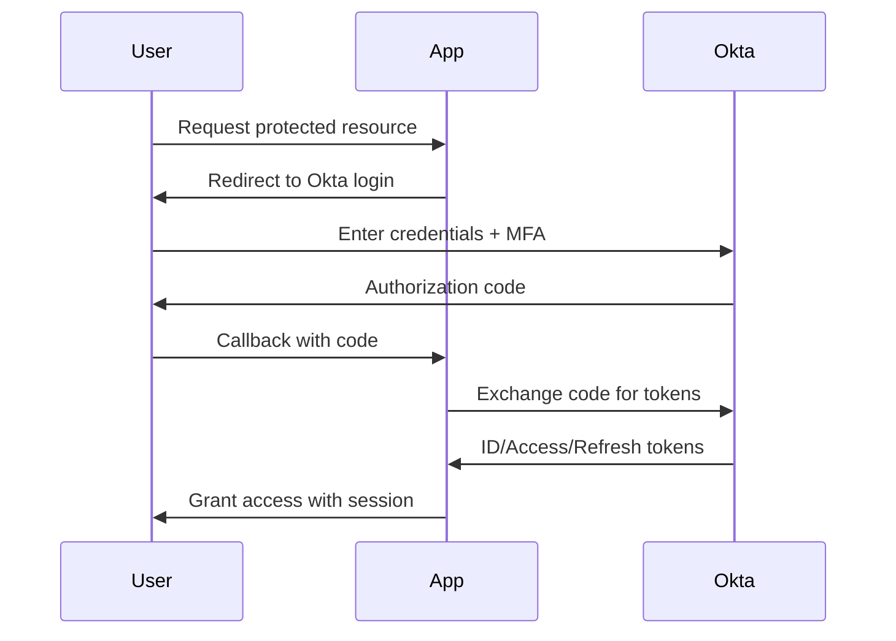

# Okta SSO for Studio Tools

## Overview
This project demonstrates how to secure media and entertainment (M&E) studio workflows with Single Sign-On (SSO) powered by Okta. It provides a compact but complete sample Express-style application that integrates with Okta using the OpenID Connect (OIDC) protocol, highlights security hardening practices, and includes automated tests to validate critical behavior. The sample simulates an asset viewer that creative professionals might use to handle sensitive intellectual property.

Key capabilities:
- OIDC login flow with session management and role-based access control (RBAC).
- Automated Okta bootstrap script for creating demonstration groups.
- Inline documentation and architecture diagrams for rapid knowledge transfer.
- Dependency-free tests (Node's built-in runner) to validate core routes and RBAC enforcement logic.

## Repository Structure
```
okta-sso-studio-tools/
├── README.md
├── CONTRIBUTING.md
├── TODO.md
├── .gitignore
├── .env.example
├── package.json
├── app.js
├── public/
│   └── index.html
├── scripts/
│   └── setup-okta.sh
├── tests/
│   └── app.test.js
└── docs/
    ├── architecture.mmd
    └── auth-flow.mmd
```

## Prerequisites
- Node.js 18+
- npm 9+ (optional: only required if you prefer running via `npm start`)
- Okta developer tenant (free tier is sufficient)
- Okta API token with permissions to create groups (for the bootstrap script)

## Setup Instructions
1. **Configure environment variables**
   Copy `.env.example` to `.env` and populate it with values from your Okta tenant.
   ```bash
   cp .env.example .env
   ```

2. **Bootstrap Okta groups (optional)**
   Edit `scripts/setup-okta.sh` with your Okta domain and API token, then run:
   ```bash
   bash scripts/setup-okta.sh
   ```
   This creates sample `Artist` and `Admin` groups to demonstrate RBAC.

3. **Run the development server**
   ```bash
   node app.js
   ```
   The sample app runs on `http://localhost:3000`. Alternatively, `npm start` proxies to the same command.

## Tests
Automated tests rely on Node's built-in test runner to avoid external dependencies. The suite ensures the application renders the welcome page, enforces RBAC, and that the mock Okta handler behaves as expected. Run the tests with:
```bash
node --test
```

## Architecture Diagram
The `docs/architecture.mmd` file contains a Mermaid diagram describing the high-level components. The same diagram is rendered below:

```mermaid
graph TD
    A[User (Artist/Editor)] -->|Access Studio Tool| B[Express-Style Web App]
    B -->|Redirect to Login| C[Okta Authorization Server]
    C -->|Authenticate & Issue Tokens| B
    B -->|Validate Token & RBAC| D[Asset Viewer]
    D -->|Secure Access| E[Creative Assets]
    subgraph Security Controls
        C
    end
```

## Authentication Flow
See `docs/auth-flow.mmd` for the sequence diagram. Rendered view:



## Usage Highlights
- `/` displays a landing page with a login link.
- `/dashboard` requires authentication and displays the user role derived from Okta group membership.
- `/admin` is restricted to members of the `Admin` group.
- Extend `public/index.html` or add new routes to integrate additional studio tooling.

## Security Considerations
- Always enable HTTPS when deploying beyond local development.
- Rotate the `SESSION_SECRET`, Okta client secret, and API tokens regularly.
- Configure multi-factor authentication (MFA) policies in Okta.
- Tailor RBAC groups to match studio personas such as Artists, Editors, and Supervisors.
- Review logs from both Okta and the Node.js application for anomaly detection.

## Edge Cases and Validation
- **Missing environment variables**: the application falls back to a mock OIDC handler so development and tests can run without external connectivity. A warning is logged to encourage proper configuration.
- **Users without group membership**: default role is set to `guest`, limiting access to restricted routes.
- **Session expiry**: Express sessions default to a 24-hour lifetime; adjust `cookie.maxAge` to meet policy requirements.
- **Okta service issues**: the mock handler prevents total outage during local development, but production deployments should implement retry/backoff logic if Okta is temporarily unavailable.

## Contributing
Please read `CONTRIBUTING.md` for detailed guidelines.

## License
This sample is provided under the MIT License.
